# Demo Financial Bot Discord - Bahasa Indonesia

## 🎯 Fitur Utama yang Didemo

### 🇮🇩 **Indonesian Implementation**

- ✅ Semua respon dalam bahasa Indonesia
- ✅ Pattern matching bahasa natural Indonesia
- ✅ Analisis keuangan yang sederhana dan logis

### 🆕 **Fitur Analisis Keuangan**

- 🏦 **Saran Anggaran**: Rekomendasi 15% dana darurat + 30% tabungan
- 🛍️ **Analisis Pembelian**: Evaluasi kemampuan beli dengan opsi alternatif
- 💡 **Konsultasi Finansial**: Bantuan perencanaan keuangan praktis

## 🚀 Demo Interaksi Bot - Fitur Analisis Keuangan

## 📊 Demo Interaksi Bot - Fitur Dasar

### 👋 Demo 1: Sapaan

```
User: @FinancialBot Hai

Bot: 👋 Hai! Saya adalah Financial Bot, asisten keuangan pintar untuk Discord!

🤖 Tentang Saya:
• Nama: Financial Bot
• Fungsi: Membantu melacak pemasukan dan pengeluaran
• Bahasa: Indonesia
• Dibuat dengan: Python

💡 Saya bisa memahami bahasa natural Indonesia, jadi kamu bisa bicara santai denganku!
Ketik !help untuk melihat semua yang bisa saya lakukan.
```

#### Screenshot

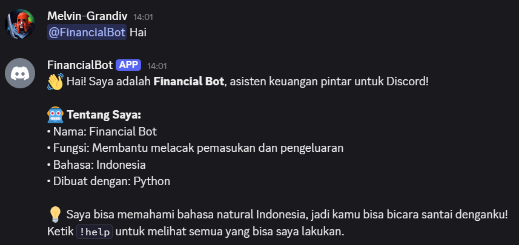

### ❗ Demo 2: Bantuan

```
User: @FinancialBot !help

Bot: 🤖 Financial Bot - Panduan Penggunaan

❗ PENTING: Mention bot (@FinancialBot) untuk menggunakan semua fitur!

Perintah Utama:
• @FinancialBot !income <jumlah> <kategori> <deskripsi> - Catat pemasukan
• @FinancialBot !expense <jumlah> <kategori> <deskripsi> - Catat pengeluaran
• @FinancialBot !balance - Lihat saldo
• @FinancialBot !report - Laporan keuangan
• @FinancialBot !delete <id> - Hapus transaksi

Fitur Analisis Keuangan:
• @FinancialBot bantuan anggaran - Saran anggaran bulanan
• @FinancialBot saya mau beli mobil 50000000 - Analisis rencana pembelian

Cara Natural:
• "@FinancialBot Saya dapat gaji 5000000 dari kantor"
• "@FinancialBot Habis 50000 untuk makanan lunch"
• "@FinancialBot Berapa saldo saya?"
• "@FinancialBot Buatkan anggaran saya"
• "@FinancialBot Saya mau beli laptop 15000000"

Pertanyaan Umum:
• "@FinancialBot Siapa kamu?" - Kenalan dengan bot
• "@FinancialBot Apa yang bisa kamu lakukan?" - Lihat kemampuan

Kategori Otomatis:
Makanan, Transport, Hiburan, Belanja, Tagihan, Kesehatan, Pendidikan, Gaji, Freelance, Investasi, dll.
```

#### Screenshot

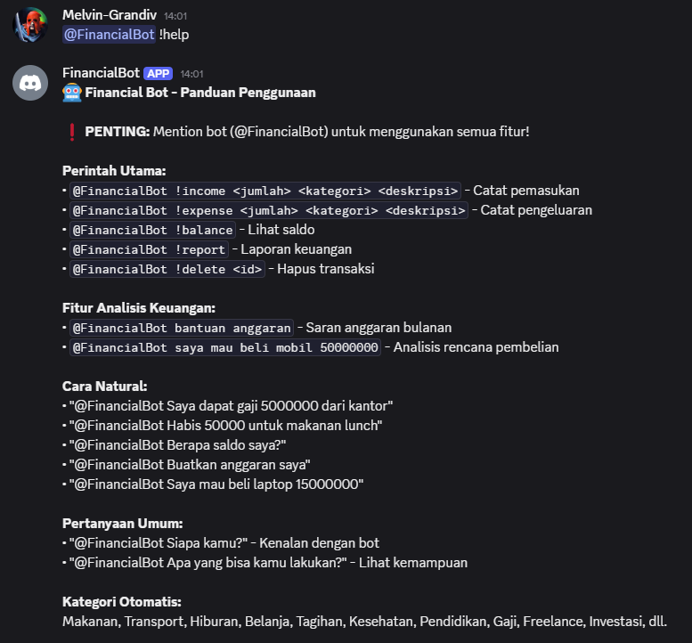

### 💰 Demo 3: Pencatatan Pemasukan

```
User: @FinancialBot saya dapat gaji 5000000 dari kantor

Bot: Baik! Saya telah mencatat pemasukan kamu sebesar Rp 5,000,000
     untuk kategori 'gaji' dengan deskripsi 'dari kantor'.
     💰 Saldo terbaru: Rp 5,000,000
```

#### Screenshot

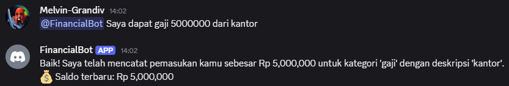

### 💸 Demo 4: Pencatatan Pengeluaran

```
User: @FinancialBot habis 50000 makan siang

Bot: Oke! Saya sudah catat pengeluaran kamu sebesar Rp 50,000
     untuk kategori 'makanan'.
     💰 Saldo terbaru: Rp 4,950,000
```

#### Screenshot


### 🏦 Demo 5: Saran Anggaran

```
User: @FinancialBot bantuan anggaran saya

Bot: 💰 Ringkasan Keuangan Bulanan:
• Pemasukan: Rp 5,000,000
• Pengeluaran: Rp 50,000
• Sisa: Rp 4,950,000

📊 Saran Penggunaan Sisa Uang:
• Dana Darurat: Rp 750,000 (15% dari gaji)
• Tabungan: Rp 1,485,000 (30% dari sisa)
• Sisanya untuk Kamu: Rp 2,715,000

👍 Bagus Sekali: Pengeluaran kamu cuma 1% dari gaji. Kamu bisa nabung banyak!

💡 Yang Harus Dilakukan:
• Sisihkan dana darurat dulu (target 6 bulan pengeluaran)
• Tabung sisanya secara rutin
• Kalau udah cukup, coba investasi
```

#### Screenshot

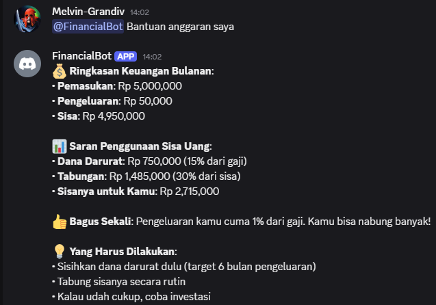

### 🛍️ Demo 6: Analisis Pembelian

```
User: @FinancialBot saya mau beli laptop 15000000

Bot: 🛍️ Analisis Beli Laptop:

Harga Barang: Rp 15,000,000
Gaji Bulanan: Rp 5,000,000
Saldo Sekarang: Rp 4,950,000

⚠️ Kurang Dana: Masih kurang Rp 10,050,000

💡 Pilihan untuk Kamu:

Pilihan 1: Nabung Dulu (2 bulan)
• Nabung Rp 4,950,000 per bulan
• Bisa beli cash tanpa hutang

Pilihan 2: Cari Alternatif Lebih Murah (Rp 9,000,000)
• Lebih mudah dijangkau
• Bisa beli lebih cepat

🎯 Saran Saya: Nabung dulu sekitar 2 bulan. Lebih aman dan tidak ada beban hutang.
```

#### Screenshot

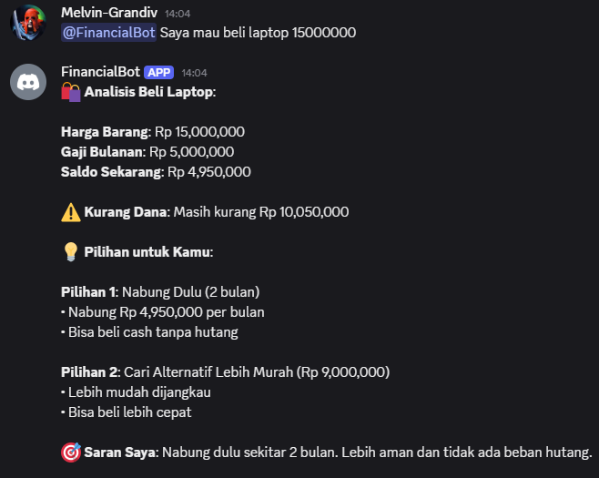

### 💸 Demo 7: Cek Saldo

```
User: @FinancialBot !balance
Bot: 💰 **Ringkasan Keuangan Kamu:**
• Pemasukan: Rp 6,500,000
• Pengeluaran: Rp 570,000
• Saldo: Rp 5,930,000 (positif)

📋 **5 Transaksi Terakhir:**
1. 💸 Rp 200,000 - tagihan
2. 💸 Rp 45,000 - makanan
3. 💸 Rp 75,000 - transport (bensin motor)
4. 💸 Rp 250,000 - makanan (groceries bulanan)
5. 💚 Rp 1,500,000 - freelance (dari projek website)

User: @FinancialBot Saldo saya
Bot: [Respons sama seperti di atas]
```

#### Screenshot

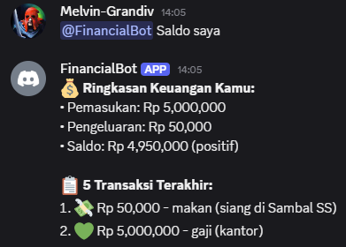

### 🏦 Demo 8: Laporan Keuangan

```
User: @FinancialBot !report
Bot: 📊 Laporan Keuangan per Kategori:

💰 Total Pemasukan: Rp 5,000,000
💸 Total Pengeluaran: Rp 50,000
📈 Saldo: Rp 4,950,000

💚 Pemasukan:
• Gaji: Rp 5,000,000

💸 Pengeluaran:
• Makan: Rp 50,000

User: @FinancialBot Laporan keuangan
Bot: [Respons sama seperti di atas]
```

#### Screenshot

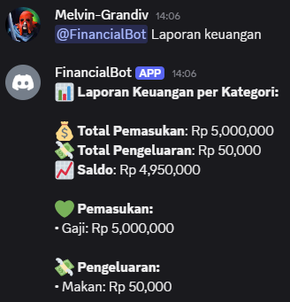

### 📈 Demo 9: Statistik Keuangan

```
User: @FinancialBot !stats
Bot: 📊 Statistik Keuangan Lengkap:

💰 Total Pemasukan: Rp 5,000,000
💸 Total Pengeluaran: Rp 50,000
📈 Saldo: Rp 4,950,000
📊 Total Transaksi: 2

📋 Transaksi Terbaru:
💸 Rp 50,000 - makan (siang di sambal ss)
💚 Rp 5,000,000 - gaji (kantor)

User: @FinancialBot Statistik keuangan
Bot: [respons sama seperti di atas]
```

#### Screenshot

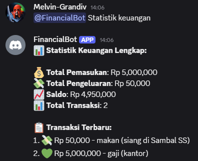

### ❌ Demo 10: Error Handling

```
User: @FinancialBot !income 0 gaji
Bot: ❌ Jumlah pemasukan harus lebih dari 0.

User: @FinancialBot hello world
Bot: Maaf, saya tidak mengerti perintah 'hello world'. Ketik `!help` untuk melihat panduan penggunaan.

User: @FinancialBot !expense 2000000 makanan
Bot: Oke! Saya sudah catat pengeluaran kamu sebesar Rp 2,000,000 untuk kategori 'makanan'.
💰 Saldo terbaru: Rp 3,930,000
⚠️ **Perhatian**: Saldo Anda sudah negatif!
```

#### Screenshot

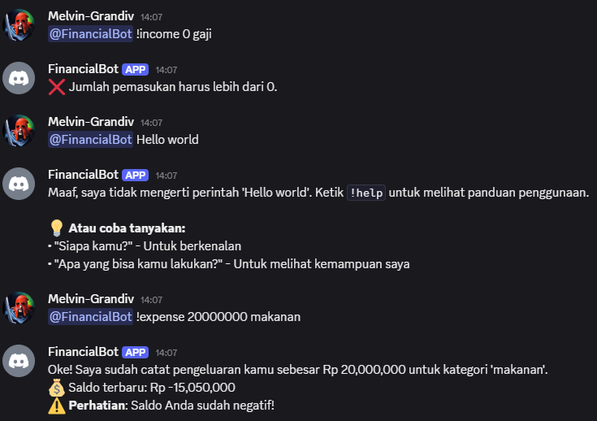

### 💰 Demo 11: Bahasa Gaul Indonesia

```
User: gue dapet 500000 projek
Bot: Baik! Saya telah mencatat pemasukan kamu sebesar Rp 500,000 untuk kategori 'freelance'.
💰 Saldo terbaru: Rp 4,430,000

User: gue habis 30000 bensin
Bot: Oke! Saya sudah catat pengeluaran kamu sebesar Rp 30,000 untuk kategori 'transport'.
💰 Saldo terbaru: Rp 4,400,000
```

#### Screenshot

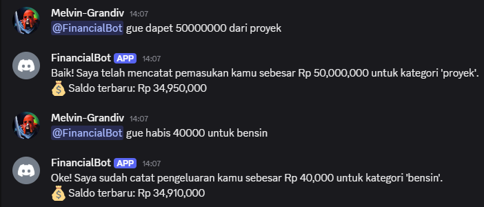

### 👥 Demo 12: Multiple Users

```
[User A]
User A: !income 3000000 gaji
Bot: Baik! Saya telah mencatat pemasukan kamu sebesar Rp 3,000,000...
💰 Saldo terbaru: Rp 3,000,000

[User B]
User B: !balance
Bot: 📭 Anda belum memiliki transaksi apapun.

[User A]
User A: !balance
Bot: 💰 **Ringkasan Keuangan Kamu:**
• Pemasukan: Rp 3,000,000
• Pengeluaran: Rp 0
• Saldo: Rp 3,000,000 (positif)
```

#### Screenshot

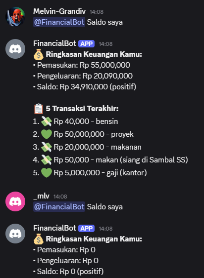

## CLI Demo

### Terminal Output

```
🤖 Financial Bot CLI Mode
========================================
Ketik 'exit' atau 'quit' untuk keluar
Ketik '!help' untuk melihat bantuan
========================================

👤 Anda: !income 1000000 gaji
🤖 Bot: Baik! Saya telah mencatat pemasukan kamu sebesar Rp 1,000,000 untuk kategori 'gaji'.
💰 Saldo terbaru: Rp 1,000,000

👤 Anda: habis 50000 makan siang
🤖 Bot: Oke! Saya sudah catat pengeluaran kamu sebesar Rp 50,000 untuk kategori 'makanan'.
💰 Saldo terbaru: Rp 950,000

👤 Anda: saldo
🤖 Bot: 💰 **Ringkasan Keuangan Kamu:**
• Pemasukan: Rp 1,000,000
• Pengeluaran: Rp 50,000
• Saldo: Rp 950,000 (positif)

📋 **2 Transaksi Terakhir:**
1. 💸 Rp 50,000 - makanan
2. 💚 Rp 1,000,000 - gaji

👤 Anda: exit
👋 Sampai jumpa!
```
